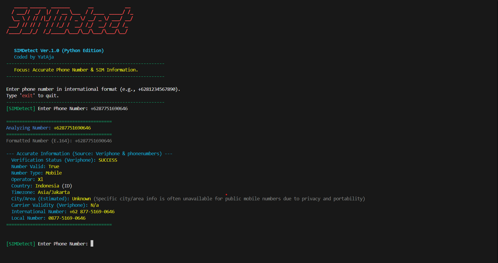

# SIMDetect - Tools Informasi Nomor HP & SIM Akurat





[](https://www.python.org/downloads/)
[](https://opensource.org/licenses/MIT)


Sebuah tools berbasis command-line (CLI) yang berfokus pada penyediaan informasi akurat mengenai nomor telepon, termasuk validasi, tipe (seluler/telepon rumah/VOIP), operator, negara, dan zona waktu.

## ✨ Fitur Utama

-   **Validasi Nomor Telepon:** Memeriksa apakah format nomor telepon valid secara struktural.
-   **Pencarian Data Akurat:** Memanfaatkan Veriphone API untuk detail presisi mengenai validitas nomor, tipe (misalnya, seluler, telepon rumah, VoIP), dan informasi operator.
-   **Cakupan Global:** Mendukung format nomor telepon internasional dari berbagai negara.
-   **Output Rinci:** Menyediakan nama operator, negara, kode negara, zona waktu, dan estimasi lokasi kota/area (dengan penjelasan keterbatasan).
-   **Mekanisme Fallback:** Jika Veriphone API gagal atau tidak tersedia, tools akan mencoba menampilkan informasi dasar dari pustaka `phonenumbers`.
-   **Antarmuka CLI yang Bersih & Menarik:** Dirancang dengan antarmuka terminal berwarna yang terinspirasi dari tools-tools di Kali Linux.

## ⚠️ Catatan Penting & Disclaimer

* **Privasi & Etika:** Harap gunakan tools ini secara bertanggung jawab dan etis. Mengumpulkan informasi pribadi tanpa persetujuan dapat melanggar hukum privasi data. Tools ini ditujukan untuk tujuan edukasi, investigasi yang sah, atau penggunaan pribadi pada nomor Anda sendiri.
* **Akurasi Lokasi (Nomor Seluler):** Perlu diperhatikan bahwa mendapatkan *kota spesifik* atau *lokasi geografis yang sangat akurat* untuk nomor telepon seluler adalah **sangat sulit, seringkali tidak tersedia untuk umum, dan umumnya tidak mungkin** menggunakan tools seperti ini karena alasan privasi dan sifat nomor seluler yang portabel. Output "Kota/Area (Estimasi)" didasarkan pada data alokasi regional awal nomor, bukan lokasi fisik pengguna saat ini. Harapkan informasi setingkat negara atau wilayah yang lebih luas, bukan akurasi jalan atau alamat.

## 🚀 Cara Menggunakan

Ikuti langkah-langkah mudah ini untuk menjalankan SIMDetect di sistem Kali Linux Anda:

1.  **Buka Terminal Anda di Kali Linux.**

2.  **Kloning repositori ini:**
    Perintah ini akan mengunduh semua file tools SIMDetect ke komputer Anda.
    ```bash
    git clone [https://github.com/mhdayattt/SIMDetect.git]((https://github.com/mhdayattt/SimDetect.git))
    ```

3.  **Masuk ke direktori tools:**
    ```bash
    cd SIMDetect
    ```

4.  **Instal semua dependensi yang diperlukan:**
    Perintah ini akan menginstal semua pustaka Python yang dibutuhkan tools agar bisa berjalan dengan baik. Pastikan Anda memiliki koneksi internet.
    ```bash
    sudo pip install -r requirements.txt
    ```
    *(Gunakan `sudo` karena Anda menginstal secara global ke sistem Kali Linux Anda.)*

5.  **Jalankan tools:**
    Sekarang tools Anda siap untuk dijalankan!
    ```bash
    python3 simdetect.py
    ```

6.  Ikuti instruksi di layar. Anda akan diminta untuk memasukkan nomor telepon dalam format internasional (contoh: `+12025550123`, `+6281234567890`).
7.  Ketik `exit` untuk keluar dari tools kapan saja.

## 🙏 Kontributor

* Dibuat oleh [YatAja](https://github.com/mhdayattt)

## 📄 Lisensi

Proyek ini dilisensikan di bawah Lisensi MIT - lihat file [LICENSE](LICENSE) untuk detailnya.
